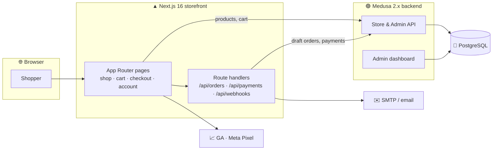
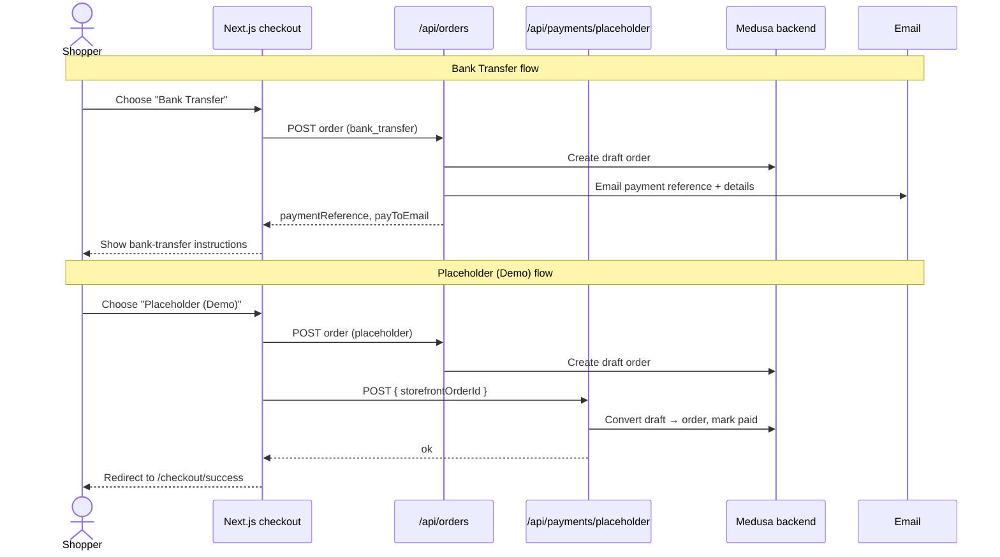

<div align="center">

# Medusa + Next.js E-commerce Kit

### An open-source, production-shaped headless commerce starter — a **Next.js 16** storefront on a **Medusa 2.x** backend.

Cart, checkout, customer accounts, order history, product catalog, transactional
email, and analytics — already wired together, so you start from a working store
instead of a blank page.

[](https://nextjs.org/)
[](https://react.dev/)
[](https://medusajs.com/)
[](https://www.typescriptlang.org/)
[](https://tailwindcss.com/)
[](https://www.postgresql.org/)
[](./LICENSE)
[](#contributing)

</div>

---

## Table of contents

- [Why this kit](#why-this-kit)
- [Features](#features)
- [Architecture](#architecture)
- [Tech stack](#tech-stack)
- [Quick start](#quick-start)
- [Checkout & payments](#checkout--payments)
- [Project structure](#project-structure)
- [Make it yours](#make-it-yours)
- [Deployment](#deployment)
- [Contributing](#contributing)
- [License](#license)

---

## Why this kit

Most headless-commerce tutorials stop at "hello products". This one ships the
parts that are actually annoying to build: a real multi-step **checkout**, a
**customer account** area with order history, **transactional email** for every
order stage, an **analytics** layer, and env-driven **branding** so one codebase
can become any store. It is intentionally provider-agnostic — swap in Stripe,
PayPal, or any gateway when you're ready to take money.

> This template ships neutral placeholder branding and products for you to
> replace with your own.

---

## Features

| | |
|---|---|
| 🛍️ **Storefront** | Home, catalog (`/shop`, `/shop/[slug]`), cart, and a multi-step checkout |
| 👤 **Customer accounts** | Register, login, profile, and order history (`/account/*`) |
| 💳 **Checkout & payments** | Generic **bank-transfer** flow + a **placeholder (demo)** payment route — provider-agnostic |
| 📧 **Transactional email** | Order-received, payment, shipped, delivered & canceled emails via any SMTP provider |
| 🎨 **Env-driven branding** | Name, colours, currency, socials & policy copy in one `brand.ts` — no code edits |
| 🔎 **SEO out of the box** | Metadata, JSON-LD, `sitemap.xml`, `robots.txt`, and `llms.txt` |
| 📈 **Analytics** | Optional Google Analytics + Meta Pixel / Conversions API |
| 🧱 **Headless backend** | Medusa 2.x: products, variants, pricing, inventory, regions, admin dashboard |
| 🧑‍💻 **Typed end-to-end** | TypeScript everywhere, `tsc --noEmit` clean |

---

## Architecture



---

## Tech stack

| Layer | Technology |
|---|---|
| Storefront | Next.js 16 (App Router) · React 19 · TypeScript 5 |
| Styling | Tailwind CSS 4 |
| Backend | Medusa 2.13 (headless commerce) |
| Database | PostgreSQL |
| Email | Nodemailer (any SMTP / transactional provider) |
| Tooling | ESLint 9 · Corepack / pnpm (backend) · npm (storefront) |

---

## Quick start

**Prerequisites:** Node 20+, a PostgreSQL database, and (optionally) Redis.

```bash
# 1. Backend (Medusa) — in the medusa/ folder
cd medusa
cp .env.template .env          # fill in DATABASE_URL etc.
npm install
npx medusa db:migrate
npm run seed                   # loads the placeholder catalog
npm run dev                    # Medusa on http://localhost:9000 (admin at /app)

# 2. Storefront (Next.js) — in a second terminal, from the repo root
cp .env.example .env.local     # set MEDUSA_* keys from your Medusa instance
npm install
npm run dev                    # storefront on http://localhost:3000
```

Get `MEDUSA_PUBLISHABLE_KEY` and `MEDUSA_REGION_ID` from the Medusa admin
(**Settings → Publishable API Keys**, and **Settings → Regions**) and paste them
into `.env.local`.

> 💡 `build-all.sh` builds both the backend and the storefront in one shot.

---

## Checkout & payments

The kit ships two provider-agnostic payment paths so checkout is complete and
runnable **without signing up for anything**:

- **Bank Transfer** — a manual-payment flow. The order is created, a payment
  reference is generated, and the customer is emailed account details to
  complete the transfer.
- **Placeholder (Demo)** — creates the order and marks it paid via
  `/api/payments/placeholder`, then lands on `/checkout/success`.
  **No real charge — do not use it to take real money.**



### Going live

Replace the placeholder in [`src/app/api/payments/`](src/app/api/payments/) with
your provider of choice. Medusa has first-party support for Stripe and others;
wire the provider **server-side** and point the checkout's payment step at it.
Search the code for `PAYMENT_PROVIDER` and the `placeholder` payment route for
the seams.

---

## Project structure

```
.
├── src/                       # Next.js storefront (App Router)
│   ├── app/                   # routes: shop, cart, checkout, account, content, api/
│   ├── components/            # UI components
│   ├── config/brand.ts        # env-driven brand config (single source of truth)
│   ├── data/                  # product fetch/shape helpers
│   └── lib/                   # medusa client, mailer, shipping, payment helpers
├── medusa/                    # Medusa 2.x backend
│   └── src/
│       ├── api/               # custom API routes
│       ├── modules/           # custom modules
│       ├── subscribers/       # event subscribers (order lifecycle → email)
│       ├── workflows/         # custom workflows
│       └── scripts/seed.ts    # placeholder catalog seed
├── public/                    # static assets / images
├── scripts/                   # ops helpers (deploy, stale-draft cleanup)
├── build-all.sh               # build backend + storefront
└── .env.example               # storefront env template
```

---

## Make it yours

| To change… | Edit |
|---|---|
| Store name, tagline, colours, currency, socials | `.env.local` / `.env` (see [`src/config/brand.ts`](src/config/brand.ts)) |
| Products | Medusa admin, or [`medusa/src/scripts/seed.ts`](medusa/src/scripts/seed.ts) |
| Home / about / FAQ / policies copy | `src/app/*/page.tsx` |
| Logo & imagery | `public/` |
| Payment provider | [`src/app/api/payments/`](src/app/api/payments/) |

Branding is intentionally env-driven — for most cosmetic changes you only touch
`.env`, no code.

---

## Deployment

- **Storefront** — deploys to any Node host or Vercel. Set the same env vars
  from `.env.example` in your host's dashboard.
- **Backend** — deploy Medusa to any Node host with a managed PostgreSQL (and
  optional Redis). See the [Medusa deployment docs](https://docs.medusajs.com/deployments).
- Point the storefront's `MEDUSA_BACKEND_URL` at your deployed backend.

---

## Contributing

Issues and PRs are welcome. Please keep changes typed (`npx tsc --noEmit` must
stay clean) and run `npm run lint` before opening a PR. See
[CONTRIBUTING.md](./CONTRIBUTING.md) for the full guide.

---

## License

[MIT](./LICENSE) © Nuraveda Labs. Use it, fork it, ship your store.

---

<div align="center">

*Built from a real, live storefront and opened up as a starting point.*
**If it saved you time, a ⭐ is appreciated.**

</div>
